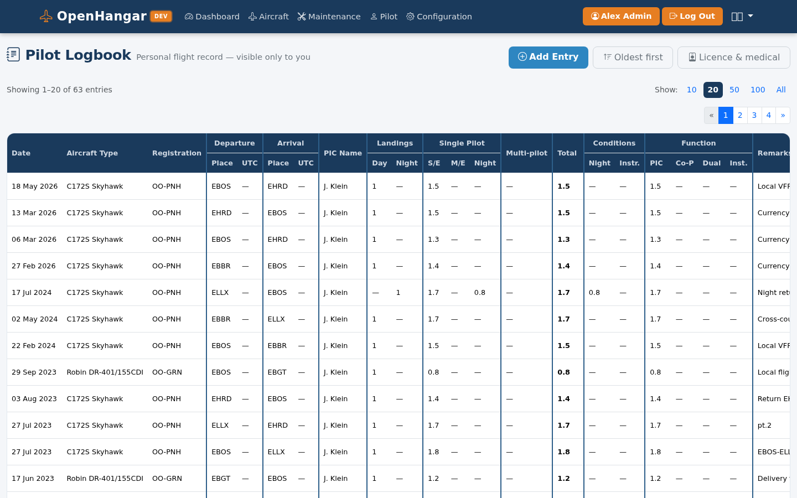

# OpenHangar — Pilot Logbook Guide

This page explains the pilot personal logbook, how it relates to the aircraft
logbook, and how the fields map to the EASA / Belgian logbook format.

---

## Relationship to the aircraft logbook

The pilot logbook is the **holder's** personal record of all flights flown. It
is distinct from the aircraft logbook (journey log) but shares source data when
the pilot files a flight entry for an aircraft managed in OpenHangar.

| | Aircraft logbook (journey log) | Pilot logbook |
|--|--|--|
| Subject | The aircraft | The pilot (holder) |
| Regulatory basis | EASA Part-M / ORO.MLR.110 | EASA FCL.050 |
| Time basis | Engine time (tach) for maintenance; flight time for hours | Flight time only |
| Who maintains it | Commander — signs each entry | Holder — for their own flights only |

A unified "log flight" form populates both logbooks in a single step: one
`Flight` row carries the aircraft-log fields and the EASA pilot-log figures,
with two crew slots (PIC and second crew), each holding a free-text name and,
optionally, the OpenHangar account of the pilot in that slot. A flight appears
in the pilot logbook of every account linked to one of its slots — see
[Flights with two pilots](#flights-with-two-pilots).

---

## Regulatory framework

OpenHangar implements the EASA AMC1 FCL.050 format, which is the form used in
Belgium and most EU member states. The same 12-column layout is used across the
EU regardless of the issuing national aviation authority.

FAA pilots are supported via the same entry form with different time categories
(see [FAA notes](#faa-specific-notes)).

---

## Pilot logbook view

The pilot logbook lists all personal flight entries with running totals at the top.

---

## Pilot logbook columns (EASA / Belgian format)

The table below maps the Belgian logbook columns to OpenHangar fields.

| # | Column header | Sub-column | OpenHangar field | Notes |
|---|---------------|------------|-----------------|-------|
| 1 | Date | — | **Date** | |
| 2 | Aircraft | Type | **Aircraft type** | Auto-filled from aircraft model when linked |
| 2 | Aircraft | Registration | **Aircraft registration** | Auto-filled when linked; free text for standalone entries |
| 3 | PIC Name | — | **PIC name** | Auto-filled from `FlightCrew[role=PIC]`; see [PIC Name](#pic-name) below |
| 4 | Departure | Place | **Departure (ICAO)** | 4-letter ICAO code |
| 4 | Departure | Time | **Departure time (UTC)** | Always UTC; see [Time entry](#time-entry) below |
| 5 | Arrival | Place | **Arrival (ICAO)** | 4-letter ICAO code |
| 5 | Arrival | Time | **Arrival time (UTC)** | Always UTC |
| 6 | Operational Condition Time | Night | **Night time** | Hours flown at night |
| 6 | Operational Condition Time | Instruments | **Instrument time** | Actual IMC or simulated under the hood |
| 7 | Landings | Day | **Day landings** | Count (integer), not hours |
| 7 | Landings | Night | **Night landings** | Count (integer), not hours |
| 8 | Single Pilot Time | S/E | **Single-engine time** | Single-pilot, single-engine hours |
| 8 | Single Pilot Time | M/E | **Multi-engine time** | Single-pilot, multi-engine hours |
| 9 | Multi Pilot Time | — | **Multi-pilot time** | Hours flown as part of a certificated multi-pilot crew |
| 10 | Total Flight Time | — | **Total flight time** | Derived: S/E + M/E + Multi-pilot |
| 11 | Holder's Operating Capacity — Pilot Function Time | PIC | **PIC time** | Hours as Pilot in Command |
| 11 | Holder's Operating Capacity — Pilot Function Time | Co-Pilot | **Co-pilot time** | Hours as co-pilot |
| 11 | Holder's Operating Capacity — Pilot Function Time | Dual | **Dual time** | Hours receiving dual instruction |
| 11 | Holder's Operating Capacity — Pilot Function Time | Instructor | **Instructor time** | Hours given as flight instructor |
| 12 | Remarks & Endorsements | — | **Remarks** | Free text; exercise descriptions during training, passenger names, notes on notable firsts, etc. |

---

## PIC Name

Field 3 always records the name of the **Pilot in Command** on that flight —
not necessarily the holder:

- When the **holder is PIC** (solo flight, or as instructor with a student):
  the holder's own name is shown, derived from their pilot profile.
- When the **holder is a student on a dual lesson**: the instructor's name is
  shown (the instructor is PIC).
- When the **holder is co-pilot**: the captain's (PIC's) name is shown.

For entries linked to an aircraft managed in OpenHangar, the PIC name is derived
automatically from the `FlightCrew` record where `role = PIC`. For standalone
entries (external aircraft) the name is entered manually as free text.

---

## Pilot function time (field 11)

Exactly one sub-column is filled per flight entry, reflecting the holder's
primary function:

| Aircraft logbook crew role | Pilot logbook function column |
|----------------------------|-------------------------------|
| PIC (Pilot in Command) | PIC time |
| COPILOT | Co-pilot time |
| SP (Student Pilot) | Dual time |
| IP (Instructor Pilot) | Instructor time |

For linked entries the function column is derived automatically from the
holder's `FlightCrew.role`; the pilot can still adjust it before saving.

---

## Single-pilot vs multi-pilot time (fields 8 and 9)

- **Single-pilot time** (S/E or M/E): flights where the holder was the only
  certificated pilot in the cockpit (solo or with a non-pilot passenger). Split
  by engine count: single-engine or multi-engine.
- **Multi-pilot time**: flights requiring a type-rated co-pilot (airline-type
  or complex multi-crew operations). Rarely applicable for GA.

For most GA pilots all hours fall under field 8 (S/E or M/E); field 9
(Multi Pilot Time) applies only to holders who also fly multi-crew aircraft.

For linked entries, single vs multi engine is derived from the aircraft's engine
configuration (number of installed engines in the `Component` table).

---

## Time entry

All times are stored and displayed in **UTC**, consistent with the aircraft
logbook.

For entries linked to an aircraft logbook flight entry, departure and arrival
times are carried over from that entry (where they are derived from counter
photo timestamps — see [aircraft logbook: time entry workflow](logbook_airplane.md#time-entry-workflow)).

For standalone entries the pilot enters times manually.

> **Timezone note:** counter photo EXIF timestamps are typically in local time.
> OpenHangar converts them to UTC using the browser's reported timezone offset.
> A future enhancement will allow detecting the UTC offset from the ICAO
> location of the departure and arrival airfields, which is more reliable for
> flights that cross timezone boundaries.

---

## Accumulated running totals

EASA AMC1 FCL.050 requires a running total of flight hours. In a physical paper
logbook this appears as a **"Total time brought forward"** row at the top of
each page. In OpenHangar the totals are computed dynamically from all entries
and displayed as a summary row at the top of the logbook view.

The following 12 values are accumulated:

| Metric | Unit |
|--------|------|
| Night time | hours |
| Instrument time | hours |
| Day landings | count |
| Night landings | count |
| Single-engine time | hours |
| Multi-engine time | hours |
| Multi-pilot time | hours |
| Total flight time | hours |
| PIC time | hours |
| Co-pilot time | hours |
| Dual time | hours |
| Instructor time | hours |

---

## Linked vs standalone entries

**Linked entries** (`flight_id` is set): automatically created or pre-filled
when the holder is listed as crew on a `FlightEntry` for an aircraft managed in
OpenHangar. Aircraft type, registration, times, PIC name, and total flight time
are populated from the aircraft logbook data. The pilot can still adjust any
field before saving.

**Standalone entries** (`flight_id` is null): manually created for flights on
aircraft not managed in OpenHangar — a rental, another club's plane, a friend's
aircraft. Aircraft registration and type are free-text fields; no link to the
aircraft database is required.

If a flight is later deleted from the aircraft logbook (or its aircraft or
import batch is deleted) while it is in a pilot's logbook, it is kept for that
pilot as a standalone entry, with the registration and type copied into the
free-text fields — the pilot's personal record is never silently lost.

---

## Flights with two pilots

The crew name fields on the *Log a flight* form suggest the pilots of the same
organisation (active users with a pilot role or the pilot capability). Picking
a colleague other than yourself sends them a **crew confirmation request**
(`FlightCrewInvite`): an e-mail (`crew_invite` notification type, on by
default), a *Flights waiting for your confirmation* panel on their dashboard
and pilot logbook, and a badge on the *Pilot* menu item.

- Their account is linked to the slot only when they **confirm**; until then
  the flight is not in their logbook and does not count towards their totals
  or currency. On confirmation their function time is filled from the slot:
  PIC → PIC time; second crew as instructor → instructor time, co-pilot →
  co-pilot time, student → dual time (a safety pilot gets no function time).
- **Declining** leaves only the typed name on the flight, and the same pilot
  is not asked again for that slot.
- Changing or removing the name before they answer cancels the request; a
  confirmed pilot is never unlinked by the logger re-saving the form.

The EASA figures live once on the flight, shared by both pilots. Who may
change what (`flights/shared_flight.py`):

- **Shared fields** (date, aircraft, route, times, flight time, landings,
  night/instrument/multi-pilot time, nature of flight, remarks) are edited by
  the pilot who logged the flight (`Flight.created_by_user_id`) while they are
  still linked to it — plus tenant owners/admins on a managed aircraft. If the
  logger is no longer linked (or the flight predates this tracking and nobody
  has been invited yet), every linked pilot may edit them.
- **Personal fields** — each slot's name, role, function time and personal
  remark (`pic_remarks` / `second_crew_remarks`) — are edited only by the
  pilot in that slot, on *My part of this flight*
  (`/flights/<id>/my-part`). The logger's form shows the other pilot's name
  and role read-only, and every save (form, standalone entry form, offline
  sync) restores them; function hours that equalled the old flight time follow
  a corrected flight time.
- A linked pilot who may not edit the shared fields is redirected from the
  edit forms to *My part of this flight*, and their offline sync of such a
  flight is refused. There they can **suggest a correction**
  (`FlightCorrectionSuggestion`): the logger accepts (applied for both, other
  pilot notified) or rejects it (suggester notified). On a managed aircraft,
  times and flight time are not suggestable since they derive from counters.
- Notification types: `crew_invite_answered` (to the logger),
  `shared_flight_changed` (to the other linked pilot, listing old → new
  values) and `flight_correction` (suggestion to the logger / rejection to the
  suggester), all on by default.
- On a shared flight, the logbook and entry detail show each pilot only their
  own function hours and personal remark.
- **Claims** (the reverse of an invite, same `FlightCrewInvite` table with
  `kind="claim"`): when the duplicate-flight check finds that the flight a
  pilot is logging was already logged by someone else, and the slot matching
  their role (PIC or Dual) is still free, the warning offers *Ask to be added
  to this flight*. The pilot(s) owning the flight's shared fields approve or
  decline (`crew_claim` notification); approval links the claimant exactly
  like a confirmed invite, using the second-crew role they entered if the
  flight names none. The duplicate check only matches other pilots' flights
  on a managed aircraft, so claims are offered there; for other aircraft the
  logger invites the crew instead.

Deleting only ever removes the acting pilot: deleting a shared flight from
your logbook (or undoing the import it came from) unlinks you and leaves the
other pilot's entry untouched; the flight itself is deleted only when no other
account is linked.

---

## FAA-specific notes

FAA (14 CFR §61.51) does not prescribe a logbook format. OpenHangar maps the
required FAA time categories onto the same entry form:

| FAA category | OpenHangar field |
|---|---|
| PIC time | PIC time (function, field 11) |
| SIC time | Co-pilot time (function, field 11) |
| Solo time | PIC time (function) + single-engine time |
| Dual received | Dual time (function, field 11) |
| Night time | Night time (operational conditions, field 6) |
| Actual IMC | Instrument time (operational conditions, field 6) |
| Day / night landings | Day / night landings (field 7) |
| Cross-country | No dedicated column; note route in Remarks |
| Safety pilot name | Remarks field (when logging simulated instrument time) |

---

## FSTD / simulator sessions

Simulator sessions (FSTD / synthetic training devices) are logged as a
dedicated entry type, matching EASA AMC1 FCL.050 column 10. When adding a
logbook entry, switch the entry type from **Flight** to **FSTD / simulator**
and record the device type (FFS, FTD, FNPT, BITD, or AATD) and the session
duration. FSTD sessions are excluded from the flight-time totals and
accumulate in their own **Sim** column and running total, mirroring the
official EASA logbook layout.
