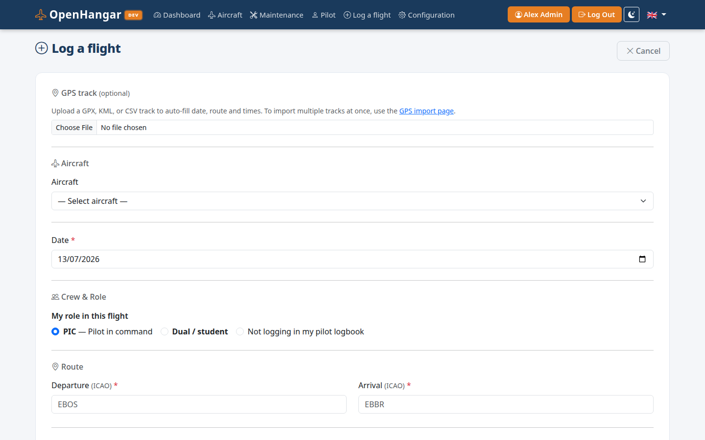
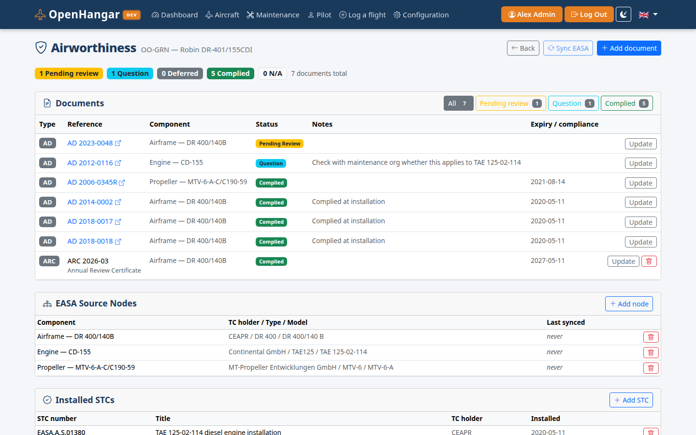
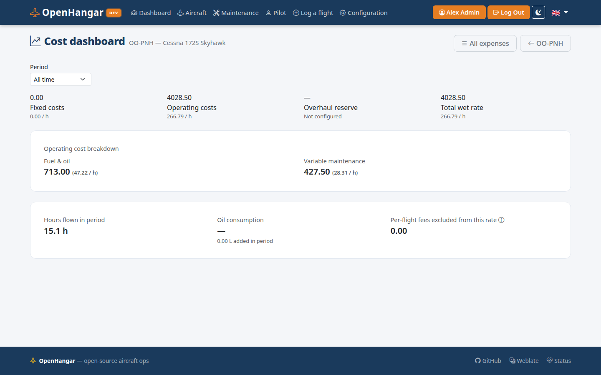
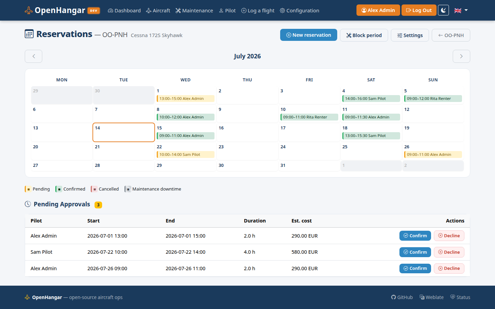
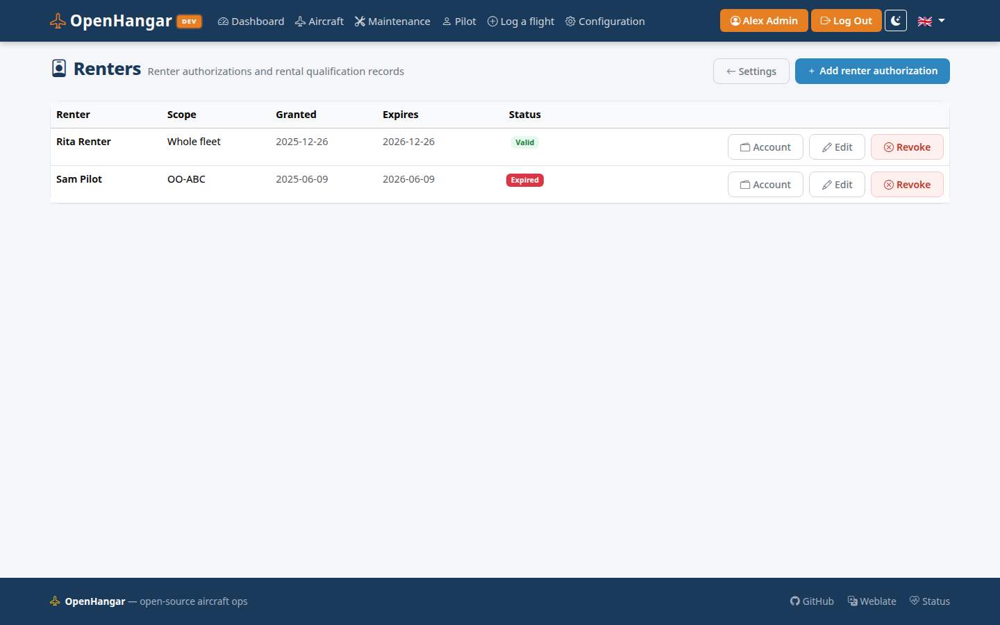
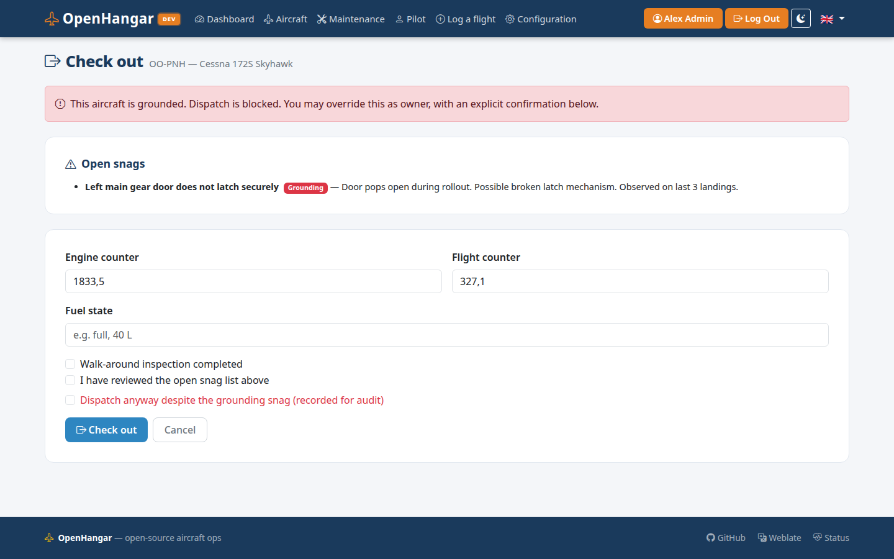
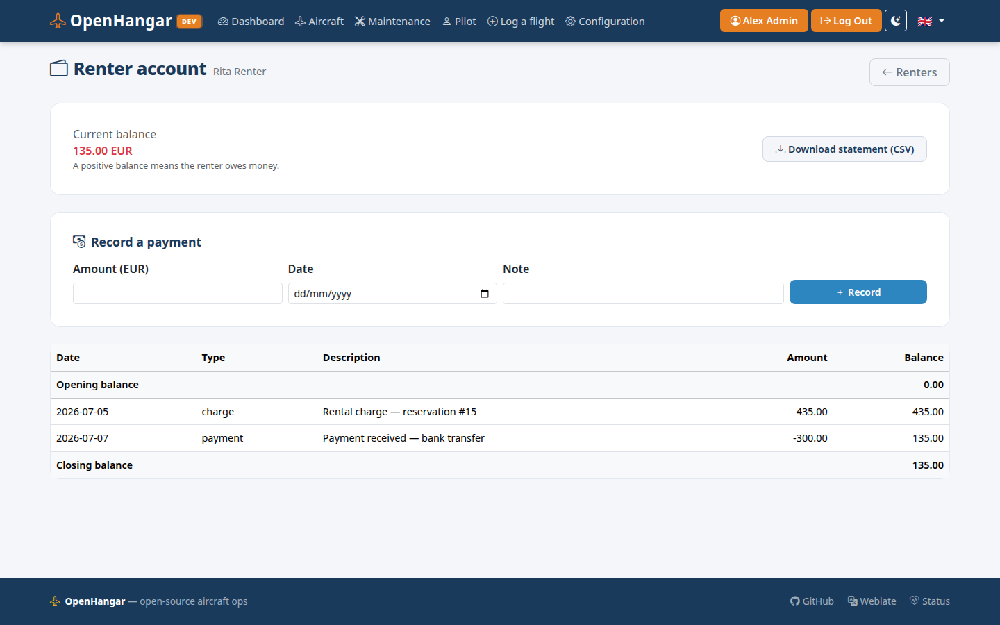
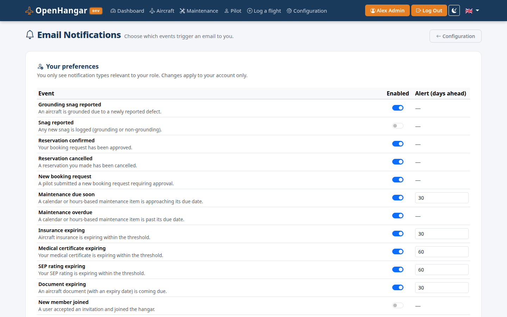

# OpenHangar — User Guide

---

## Who is OpenHangar for?

OpenHangar is a self-hosted aviation management platform — from a solo pilot wanting a personal logbook to a flying club managing a shared fleet.

| If you are… | OpenHangar can… |
|---|---|
| A solo pilot | Track your personal logbook, flight currency, and flight history |
| An aircraft owner | Manage your aircraft, maintenance schedules, documents, and costs |
| A flying club or flight school | Run a shared fleet with multi-user access and role-based permissions |

How the app behaves depends on two things: the **operating model** you choose when setting up your installation, and the **role** each person is assigned when invited.  Both are explained in the sections below.

---

## Operating models

The operating model is chosen once during first-time setup and tells the app how to organise your data and which features to show.  You can change it later in **Configuration → Usage profile**.

| Model | Who it's for | Features enabled |
|---|---|---|
| **Sole pilot (logbook only)** | A pilot who wants a personal logbook without managing any aircraft | Pilot logbook only — no aircraft, maintenance, expenses, or fleet features |
| **Sole operator** | An individual who owns and manages one or more aircraft | Full aircraft management, maintenance tracking, expenses, documents; optional rental to others |
| **Shared ownership** | Two or more co-owners of one or more aircraft | As sole operator, plus co-owner accounts with shared access to the fleet |
| **Flight club** | A member-based flying club | Multi-user, shared fleet, club name branding, member management |
| **Flight school** | A training organisation | Multi-user, shared fleet, school name branding, instructor and student roles |

Changing the model only adjusts which features the interface shows — your existing data is never deleted.

Each person you then invite to your installation is assigned a **role** that controls what they can personally see and do, independently of the operating model.  See [Roles & access control](#roles--access-control) below.

---

## Key features

- **Fleet management** — model airframe, engines, props, and avionics; lightweight placeholders for quick onboarding; archive a retired aircraft without losing its history.
- **Maintenance tracking** — calendar and hours-based triggers with a clear green/yellow/red dashboard status; engine and propeller TBO and life-limited component tracking.
- **Flight logging** — one unified form that fills the aircraft and pilot logbooks together; counter pre-fill, photo proofs, fuel and oil tracking, GPS-file autofill.
- **Pilot logbook** — EASA FCL.050 layout with passenger/night currency tracking, FSTD/simulator sessions, and bulk import from CSV or Excel.
- **GPS tracks** — import GPX, KML, or Garmin CSV files; per-flight maps, a cumulative track view, and downloadable track images and animations.
- **Airworthiness** — track ADs, SIBs, ARC, and installed STCs per aircraft, with automatic daily sync from the EASA Safety Publications Tool.
- **Snag tracking** — log defects, flag grounding items, and see them fleet-wide before the next flight.
- **Reservations** — per-aircraft booking calendar with owner approval, conflict detection, and cost estimation (shown when rental is enabled).
- **Mass & balance** — per-aircraft envelope configuration and loaded CG calculation with a visual envelope chart.
- **Cost tracking** — expenses with receipt attachments, recurring fixed costs, and an operating-cost dashboard computing the true hourly (wet) rate.
- **Document management** — attach PDFs and photos to aircraft, components, pilots, and logbook entries; inline viewer; sensitive-document controls hide files from renter/viewer roles; Syncthing-friendly on-disk layout.
- **Share links** — passwordless read-only aircraft status pages with QR codes, for notice boards or your maintenance shop.
- **Email notifications** — per-user preferences for maintenance, airworthiness, reservation, and pilot-currency alerts.
- **Progressive Web App** — installable on mobile; offline flight logging with automatic sync when connectivity returns.
- **Security** — role-based access with per-aircraft permissions, optional TOTP 2FA, and encrypted AES-256-GCM backups with built-in scheduling and retention (see [backup & restore guide](backup_restore.md)).
- **Multi-language** — English, French, Dutch; language selectable per user.

---

## Getting around

Once logged in, the **Dashboard** gives you a fleet overview: status badges per aircraft, recent flights, maintenance alerts, and pilot currency summary.

The navbar provides access to:

| Section | What you can do |
|---|---|
| **Dashboard** | Fleet overview, alerts, quick stats, and your pilot currency summary |
| **Aircraft** | Manage the fleet — components, flights, snags, documents, expenses, mass & balance, airworthiness, share links |
| **Log a flight** | Unified flight entry that fills the aircraft and pilot logbooks in one step |
| **Maintenance** | Fleet-wide maintenance overview and per-aircraft triggers |
| **Pilot** | Personal logbook, pilot profile & documents, logbook import |
| **Configuration** | Users & permissions, notifications, backups, email, tenants *(administrators)* |

The per-aircraft booking calendar (**Reservations**) is reached from the
dashboard and aircraft pages when rental is enabled in your usage profile.

---

## Key user flows

### First-time setup

1. An administrator creates the organisation and the first user account (owner).
2. Add aircraft — choose lightweight (registration only) or full model (airframe + engines + props + avionics).
3. Define maintenance triggers for each aircraft (date-based or hours-based), and optionally TBO / life limits on engine and propeller components.
4. Start logging flights.

The fleet is visible at a glance on the **Aircraft** page:

Each aircraft has a detail page showing current status, components, recent flights, and documents:

### Logging a flight

1. Click **Log a flight** in the navbar.
2. Check the pre-filled counter start values and enter the end values (flight and engine time counters); attach a photo of the instruments, or upload a GPS file to autofill times and route.
3. Save — the system updates component totals and re-evaluates all maintenance triggers automatically. If you were flying, the same form creates the matching entry in your personal pilot logbook.

The **Aircraft logbook** shows all flight entries for a specific aircraft (journey log):

The **Pilot logbook** view shows your personal flight history with EASA FCL.050 column mapping:

The **Mass & balance** page lets you record and verify CG position before a flight:

### Importing an existing pilot logbook

If you have a previous logbook in a spreadsheet (CSV or Excel), OpenHangar can import it in a few steps:

1. Navigate to **Pilot → Import logbook**.
2. Upload your CSV or Excel file.

3. Map each column in your file to the corresponding OpenHangar logbook field using the dropdown selectors.  OpenHangar remembers the mapping the next time you upload a file with the same structure, and pre-fills the dropdowns automatically with a notice "recognised from a previous import — please verify".
4. *(Optional)* If your file does not cover your full flying history, check **"I already had hours before this file starts"** and enter cumulative totals for each time category.  OpenHangar will create a single synthetic "Opening balance" entry dated one day before the earliest imported row.
5. Review the import summary: rows imported, subtotal rows skipped, and any rows that could not be parsed (with the reason).  Click **Confirm** to save.

Sub-total rows (rows where the date cell contains "TOTAL", is blank, or contains a running sum) are detected and skipped automatically — they do not need to be removed from the file beforehand.

#### Import history and rollback

Every import is recorded on the **Pilot → Import history** page.  If you imported incorrect data, click **Delete this import** to remove all entries that belong to that batch in one operation — your manually-entered entries are never affected.

---

### Personal minimums

Alongside the legal limits, most pilots fly to a stricter set of **personal minimums** — self-imposed limits on wind, weather, and other conditions that guide go/no-go decisions. OpenHangar keeps this document next to your logbook instead of on a piece of paper:

1. From **Pilot → Personal minimums**, start from a **blank**, **light**, or **full** template — each is just a starting structure of sections and items, all editable and removable afterwards.
2. Fill in your own values, optionally tagging an item with a semantic meaning (e.g. "days since last flight") so OpenHangar can compute it automatically from your logbook and warn you when you're outside your own comfort zone.
3. **Publish** when ready — this stamps the revision with today's date and your current total flight hours, and supersedes the previously active revision (kept, read-only, in your history, so you can see how your minimums evolved with experience).

Minimums are never edited on the day of a flight — the "Log a flight" form shows your active minimums in a read-only, collapsible panel for reference only. A recency reminder appears on your logbook page (and can trigger an email notification) when a tagged threshold is exceeded, e.g. more days since your last flight than your own comfort-zone limit.

### Monitoring maintenance

- The dashboard shows a colour status badge (green / yellow / red) per aircraft.
- The Maintenance list view sorts items by urgency: overdue → due soon → scheduled.
- Overdue items also appear as alerts on the dashboard.

### Tracking airworthiness

Each aircraft has an **Airworthiness** page tracking Airworthiness Directives, Safety Information Bulletins, the ARC, and installed STCs.  Components are mapped to EASA Safety Publications Tool entries; a daily sync pulls newly published documents and marks them *pending review*, and each document then moves through a compliance workflow (complied / not applicable / deferred / question for your maintenance organisation).

### Understanding operating costs

The **Cost dashboard** (linked from the aircraft's Expenses section) splits expenses into fixed and operating categories and divides them by the hours actually flown, giving the true all-in hourly (wet) rate over a selectable period.

### Booking an aircraft

When rental is enabled in your usage profile, each aircraft has a **booking calendar**.  Pilots request a slot; the owner confirms or declines, with automatic conflict detection and a cost estimate based on the aircraft's hourly rate.

Creating or confirming a reservation on a **grounded** aircraft (an open grounding snag) shows a warning; a per-tenant setting can escalate this to a hard block for renters — owners are always allowed to proceed, since they may be booking the aircraft for the shop visit itself. Owners can also block out a period for planned maintenance downtime (e.g. an annual inspection) directly from the calendar; it conflicts with confirmed reservations the same way another confirmed reservation would.

### Renting your aircraft

For a sole operator who rents or lends their aircraft to other pilots, OpenHangar closes the loop from booking through to settlement: **authorize → reserve → check out → fly → check in → charge → settle.**

1. **Authorize renters.** From **Configuration → Renters**, record who is qualified to fly which aircraft (or the whole fleet), when the authorization was granted and when it expires, and the checkout flight that verified it. This is an owner-entered fact, not an automatic read of the renter's private pilot profile.

   

2. **Check out and check in.** When a renter's reservation comes up, the check-out step captures counter readings, fuel state, and confirmation that the walk-around and the open-snag list were reviewed. Check-in captures the return counters and compares them against any flights logged during the rental window, flagging a discrepancy if they don't match.

   

3. **Review and finalize the charge.** OpenHangar drafts a rental charge automatically at check-in from the counter delta and the aircraft's rate settings (wet/dry, engine or flight time, minimum hours per day). The owner reviews the draft — adjusting hours, rate, or fuel credit if needed — and finalizes it, which posts a single, permanent entry to the renter's account. A finalized charge cannot be edited; corrections go through a reversal instead.

4. **Track the balance.** Each renter has a running account: finalized charges minus payments received. Owners record payments manually from the renter's account page; renters see the same balance and statement from their own **My account** page. Either view can export a CSV statement for a given period.

   

### Managing documents

Upload any PDF, image, or document from the Aircraft or Component detail page.
Mark a document **sensitive** at upload time to hide it from renter/viewer roles
while keeping it visible to owners and admins.

Backups, SMTP settings, and usage profile are managed from the **Configuration** page (administrators only):

### Choosing your notifications

Every user picks which email notifications they receive — maintenance, airworthiness, reservation, and pilot-currency alerts — from **Configuration → Notifications**.  Administrators can additionally set fleet-wide defaults.

---

## Roles & access control

Roles are per-person settings within an installation — they control what each user can see and do, regardless of which operating model is in use.  A sole operator with a single admin account has the same role system available as a flight school with dozens of members.

OpenHangar uses a role-based model combined with per-aircraft access grants.

| Role | Summary |
|---|---|
| **Admin** | Full access to everything including system configuration |
| **Owner** | Full access to fleet, maintenance, flights, and user management |
| **Pilot** | Log flights, create reservations; access limited to assigned aircraft |
| **Maintenance** | View and update maintenance; access limited to assigned aircraft |
| **Viewer** | Read-only; access limited to assigned aircraft |

Two additional roles — **Student** and **Instructor** — exist in preparation for the flight-school features.

When inviting a user, the owner selects their role and checks which aircraft they are allowed to access.  Admin and Owner roles automatically see every aircraft.

Beyond the base role, each user carries three capability flags: **pilot** (personal logbook, reservations, flight logging), **maintenance** (edit aircraft and components, manage maintenance), and **view-only** (removes all write access regardless of the other settings).  Administrators can also fine-tune a per-aircraft permission grid (view/edit aircraft, maintenance read level, flight logging, reservations, …) or grant a user access to **all aircraft, including ones added later**.  See the [access control reference](access-control.md) for the full model and the default permissions per role.

The aircraft detail page adapts to each role: the sections shown, the actions available, and the order in which sections appear all change depending on who is viewing.  See the [aircraft detail layout reference](detail_layout_aircraft.md) for the full section-by-role matrix.

---

## Logbook reference

- [Aircraft logbook guide](logbook_airplane.md) — field definitions, EASA vs FAA columns, counter types.
- [Pilot logbook guide](logbook_pilot.md) — personal logbook fields, EASA FCL.050 mapping, currency rules.

---

## Glossary

| Term | Definition |
|---|---|
| **Hobbs** | Flight hour meter used to track aircraft usage |
| **Lifed part** | A component with a finite operational life measured in hours, cycles, or calendar time |
| **AD** | Airworthiness Directive — mandatory regulatory action issued by an aviation authority |
| **SB** | Service Bulletin — manufacturer advisory (may or may not be mandatory) |
| **CAMO** | Continuing Airworthiness Management Organisation |
| **POH** | Pilot's Operating Handbook — the aircraft-specific manual with limitations, procedures, and performance data |
| **EASA** | European Union Aviation Safety Agency |
| **FAA** | Federal Aviation Administration (United States) |
| **TOTP** | Time-based One-Time Password — used for two-factor authentication (2FA) |

---

## Contributing translations

OpenHangar is available in English, French, and Dutch. If you'd like to help
translate it into another language, or improve an existing translation, visit
[hosted.weblate.org](https://hosted.weblate.org/engage/openhangar/) — no technical knowledge or
Git access required, just a free Weblate account.
