# OpenHangar — User Guide

---

## Who is OpenHangar for?

OpenHangar is a self-hosted aviation management platform — from a solo pilot wanting a personal logbook to a flying club managing a shared fleet.

| If you are… | OpenHangar can… |
|---|---|
| A solo pilot | Track your personal logbook, flight currency, and flight history |
| An aircraft owner | Manage your aircraft, maintenance schedules, documents, and costs |
| A flying club or flight school | Run a shared fleet with multi-user access and role-based permissions |

How the app behaves depends on two things: the **operating model** you choose when setting up your installation, and the **role** each person is assigned when invited.  Both are explained in the sections below.

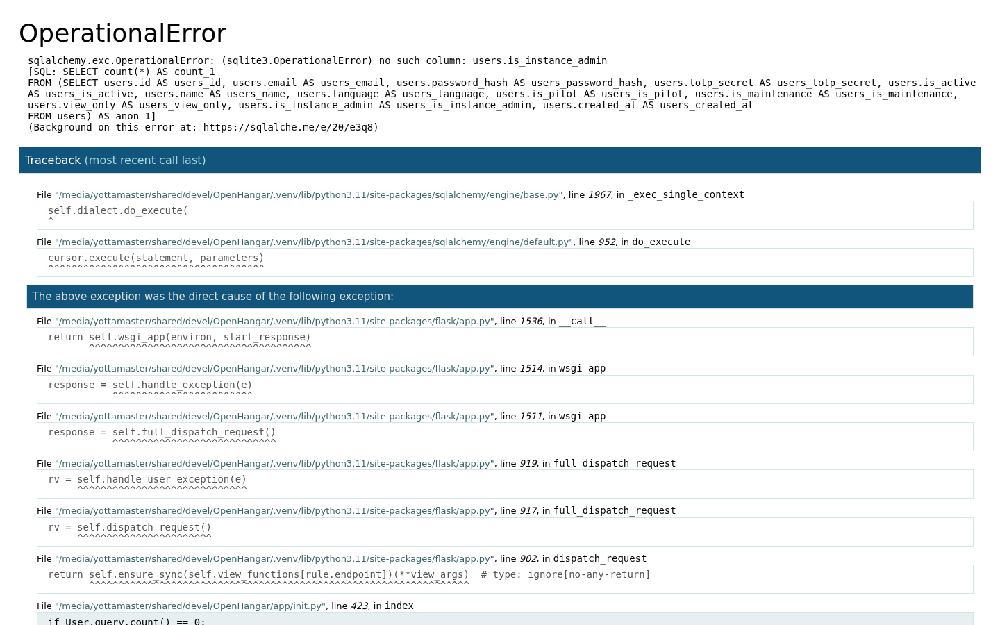

---

## Operating models

The operating model is chosen once during first-time setup and tells the app how to organise your data and which features to show.  You can change it later in **Configuration → Usage profile**.

| Model | Who it's for | Features enabled |
|---|---|---|
| **Sole pilot (logbook only)** | A pilot who wants a personal logbook without managing any aircraft | Pilot logbook only — no aircraft, maintenance, expenses, or fleet features |
| **Sole operator** | An individual who owns and manages one or more aircraft | Full aircraft management, maintenance tracking, expenses, documents; optional rental to others |
| **Shared ownership** | Two or more co-owners of one or more aircraft | As sole operator, plus co-owner accounts with shared access to the fleet |
| **Flight club** | A member-based flying club | Multi-user, shared fleet, club name branding, member management |
| **Flight school** | A training organisation | Multi-user, shared fleet, school name branding, instructor and student roles |

Changing the model only adjusts which features the interface shows — your existing data is never deleted.

Each person you then invite to your installation is assigned a **role** that controls what they can personally see and do, independently of the operating model.  See [Roles & access control](#roles--access-control) below.

---

## Key features

- **Fleet management** — model airframe, engines, props, and avionics; lightweight placeholders for quick onboarding.
- **Maintenance tracking** — calendar, hours, and cycles-based triggers with a clear green/yellow/red dashboard status.
- **Flight logging** — hobbs/tach entries, optional photo proofs of instrument readings, automatic logbook updates.
- **Pilot logbook** — personal logbook with EASA FCL.050 column mapping, passenger/night currency tracking, and bulk import from CSV or Excel.
- **Document management** — attach PDFs and photos to aircraft, components, and logbook entries; sensitive-document controls hide files from renter/viewer roles.
- **Cost tracking** — per-flight and periodic expenses; L/gal unit conversion; cost-per-hour calculations.
- **Encrypted backups** — AES-256-GCM daily backups with SHA-256 verification (see [backup & restore guide](backup_restore.md)).
- **Multi-language** — English, French, Dutch; language selectable per user.

---

## Getting around

Once logged in, the **Dashboard** gives you a fleet overview: status badges per aircraft, recent flights, maintenance alerts, and pilot currency summary.

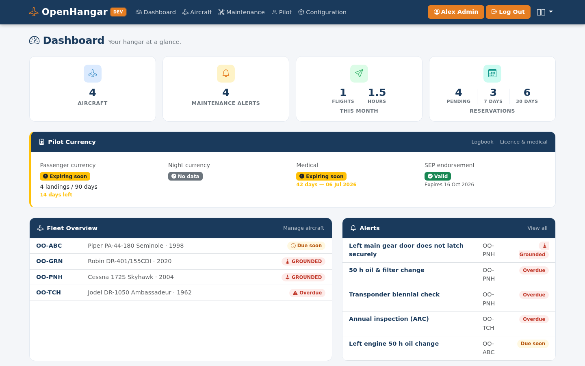

The navbar provides access to:

| Section | What you can do |
|---|---|
| **Aircraft** | Manage fleet, component details, snags |
| **Flights** | Log and browse flight entries |
| **Maintenance** | View and manage maintenance triggers |
| **Documents** | Upload and browse documents |
| **Expenses** | Log and review costs |
| **Pilot** | Personal logbook and pilot profile |
| **Configuration** | Backups and email settings *(administrators)* |

---

## Key user flows

### First-time setup

1. An administrator creates the organisation and the first user account (owner).
2. Add aircraft — choose lightweight (registration only) or full model (airframe + engines + props + avionics).
3. Define maintenance triggers for each component (date-based, hours-based, or cycles-based).
4. Start logging flights.

The fleet is visible at a glance on the **Aircraft** page:

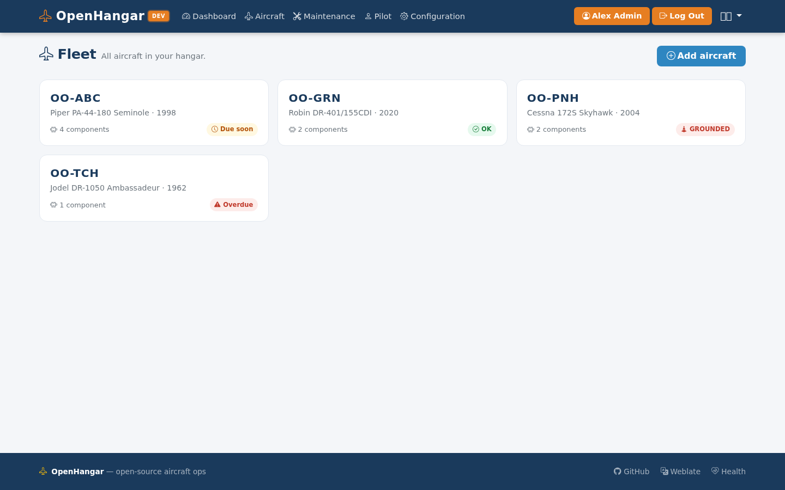

Each aircraft has a detail page showing current status, components, recent flights, and documents:

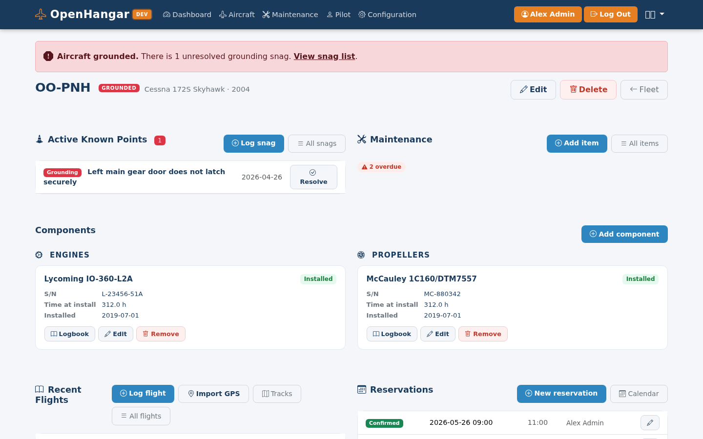

### Logging a flight

1. Navigate to **Flights → Log flight**.
2. Enter hobbs/tach start and end values; attach a photo of the instrument if desired.
3. Save — the system updates component totals and re-evaluates all maintenance triggers automatically.

The **Aircraft logbook** shows all flight entries for a specific aircraft (journey log):

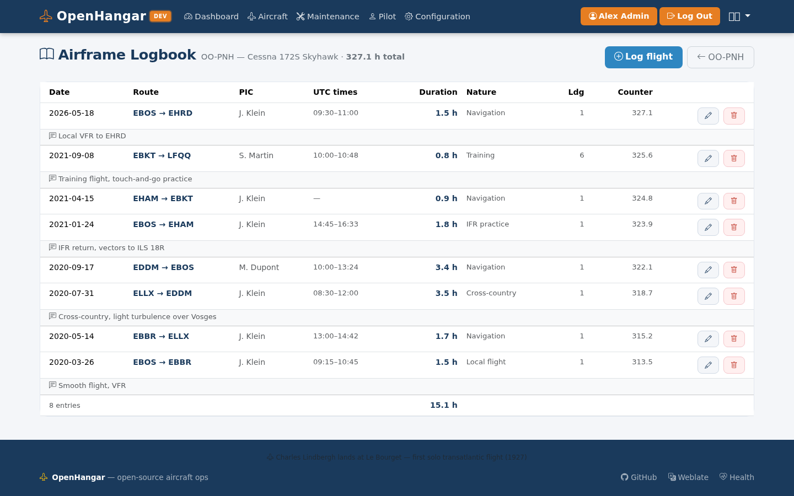

The **Pilot logbook** view shows your personal flight history with EASA FCL.050 column mapping:

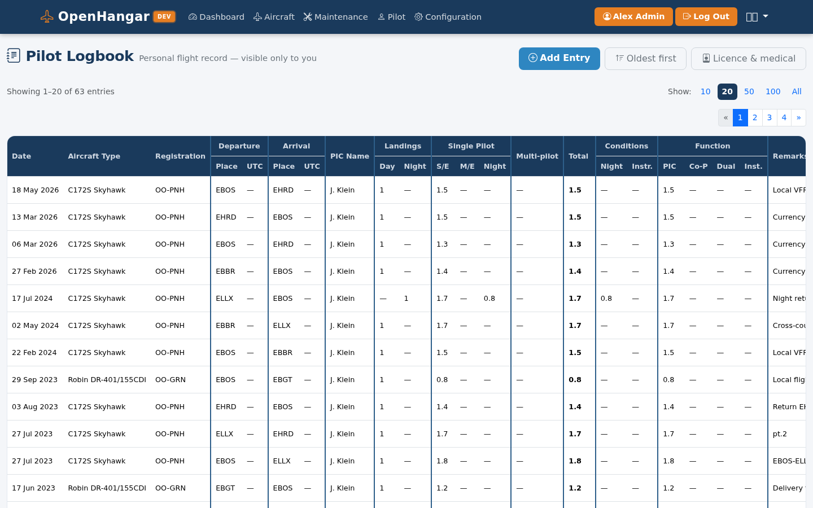

The **Mass & balance** page lets you record and verify CG position before a flight:

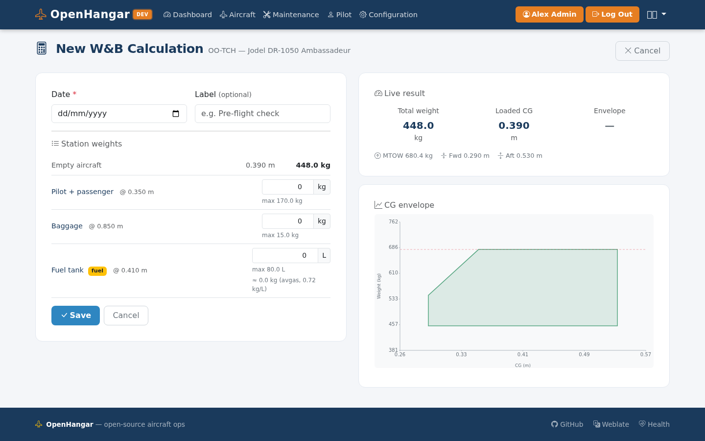

### Importing an existing pilot logbook

If you have a previous logbook in a spreadsheet (CSV or Excel), OpenHangar can import it in a few steps:

1. Navigate to **Pilot → Import logbook**.
2. Upload your CSV or Excel file.

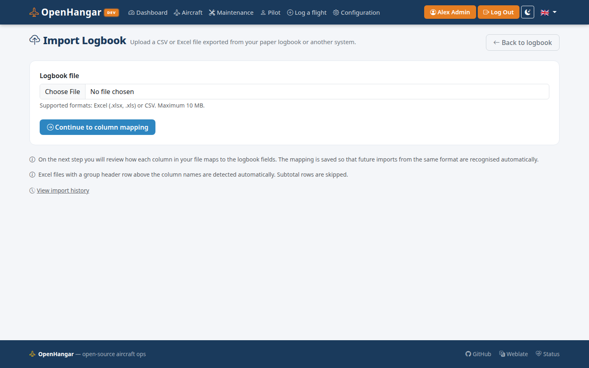

3. Map each column in your file to the corresponding OpenHangar logbook field using the dropdown selectors.  OpenHangar remembers the mapping the next time you upload a file with the same structure, and pre-fills the dropdowns automatically with a notice "recognised from a previous import — please verify".
4. *(Optional)* If your file does not cover your full flying history, check **"I already had hours before this file starts"** and enter cumulative totals for each time category.  OpenHangar will create a single synthetic "Opening balance" entry dated one day before the earliest imported row.
5. Review the import summary: rows imported, subtotal rows skipped, and any rows that could not be parsed (with the reason).  Click **Confirm** to save.

Sub-total rows (rows where the date cell contains "TOTAL", is blank, or contains a running sum) are detected and skipped automatically — they do not need to be removed from the file beforehand.

#### Import history and rollback

Every import is recorded on the **Pilot → Import history** page.  If you imported incorrect data, click **Delete this import** to remove all entries that belong to that batch in one operation — your manually-entered entries are never affected.

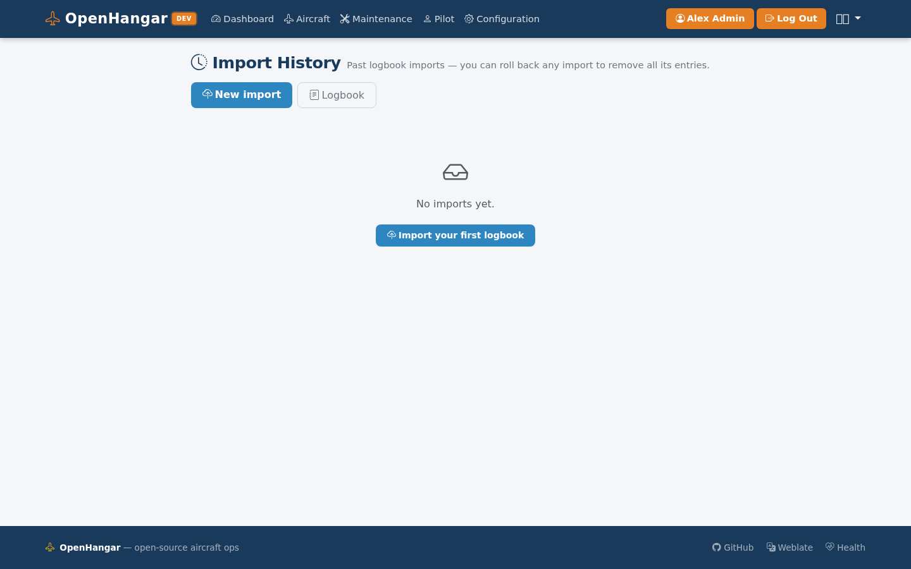

---

### Monitoring maintenance

- The dashboard shows a colour status badge (green / yellow / red) per aircraft.
- The Maintenance list view sorts items by urgency: overdue → due soon → scheduled.
- Overdue items also appear as alerts on the dashboard.

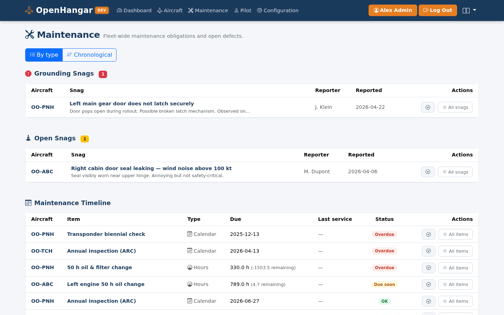

### Managing documents

Upload any PDF, image, or document from the Aircraft or Component detail page.
Mark a document **sensitive** at upload time to hide it from renter/viewer roles
while keeping it visible to owners and admins.

Backups, SMTP settings, and usage profile are managed from the **Configuration** page (administrators only):

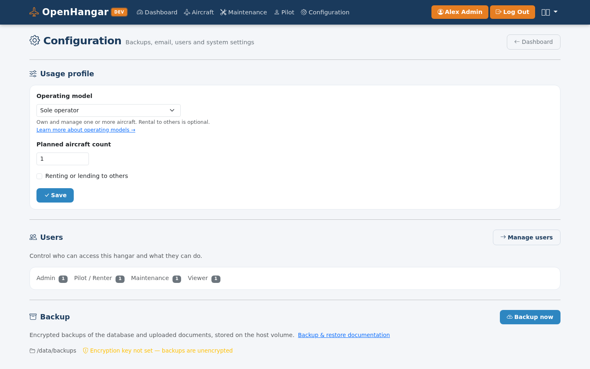

---

## Roles & access control

Roles are per-person settings within an installation — they control what each user can see and do, regardless of which operating model is in use.  A sole operator with a single admin account has the same role system available as a flight school with dozens of members.

OpenHangar uses a role-based model combined with per-aircraft access grants.

| Role | Summary |
|---|---|
| **Admin** | Full access to everything including system configuration |
| **Owner** | Full access to fleet, maintenance, flights, and user management |
| **Pilot** | Log flights, create reservations; access limited to assigned aircraft |
| **Maintenance** | View and update maintenance; access limited to assigned aircraft |
| **Viewer** | Read-only; access limited to assigned aircraft |

When inviting a user, the owner selects their role and checks which aircraft they are allowed to access.  Admin and Owner roles automatically see every aircraft.

The aircraft detail page adapts to each role: the sections shown, the actions available, and the order in which sections appear all change depending on who is viewing.  See the [aircraft detail layout reference](detail_layout_aircraft.md) for the full section-by-role matrix.

> A more granular permission model — profile types, per-aircraft permission bits, and an "access to all aircraft" option — is planned for a future release.
> See the [access control reference](access-control.md) for the full target model and role capability matrix (⚠ not yet implemented).

---

## Logbook reference

- [Aircraft logbook guide](logbook_airplane.md) — field definitions, EASA vs FAA columns, counter types.
- [Pilot logbook guide](logbook_pilot.md) — personal logbook fields, EASA FCL.050 mapping, currency rules.

---

## Glossary

| Term | Definition |
|---|---|
| **Hobbs** | Flight hour meter used to track aircraft usage |
| **Lifed part** | A component with a finite operational life measured in hours, cycles, or calendar time |
| **AD** | Airworthiness Directive — mandatory regulatory action issued by an aviation authority |
| **SB** | Service Bulletin — manufacturer advisory (may or may not be mandatory) |
| **CAMO** | Continuing Airworthiness Management Organisation |
| **POH** | Pilot's Operating Handbook — the aircraft-specific manual with limitations, procedures, and performance data |
| **EASA** | European Union Aviation Safety Agency |
| **FAA** | Federal Aviation Administration (United States) |
| **TOTP** | Time-based One-Time Password — used for two-factor authentication (2FA) |

---

## Contributing translations

OpenHangar is available in English, French, and Dutch. If you'd like to help
translate it into another language, or improve an existing translation, visit
[hosted.weblate.org](https://hosted.weblate.org/engage/openhangar/) — no technical knowledge or
Git access required, just a free Weblate account.
